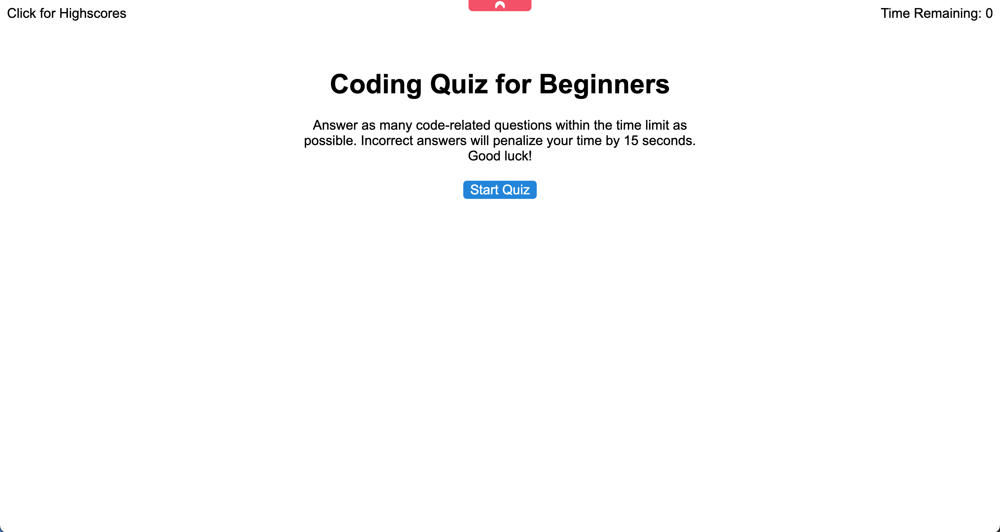
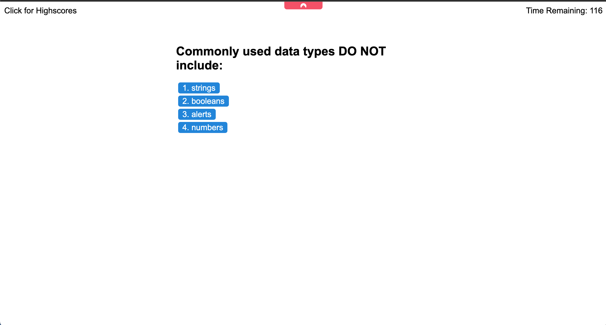
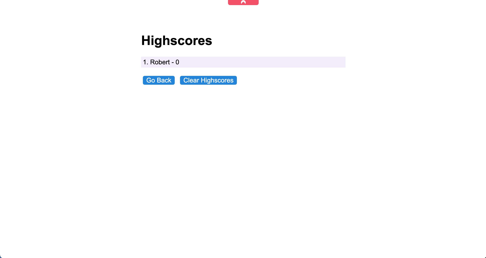

# Code Quiz 

Project Page: [Project Page](https://timothymichaelcook.github.io/4-code-quiz-cook)
Project Repo: [Github-repo](https://github.com/timothymichaelcook/4-code-quiz-cook)


## Description

The focus of this project was to create an application that displayed a timed quiz, with multiple choice and T/F questions are displayed as either correct or incorrect as soon as the click event occurred on the button. The quiz will generate as many questions as possible within the time frame as repetition is important when learning. Users can save their information in a high scores table that will populate every time a score is saved. This table also has the ability to be cleared.

## User Story

```
- AS A teacher
- I WANT to have quiz on computer programming fundamentals
- SO THAT my students are knowledgeable about computer programming
```

## Installation

N/A

## Usage

Users click the "Start Quiz" button which will redirect to a new page with a running timer and a container for displayed questions. Users click their answer or best guess which is then returned with a result. Users finally have the ability to save their scores at the end of every quiz as well as clearing all results as well.


## Credits

University of Richmond Coding Bootcamp

## License

MIT License

## Screenshots







## Contact
Timothy Cook - timothy.michael.cook@gmail.com
