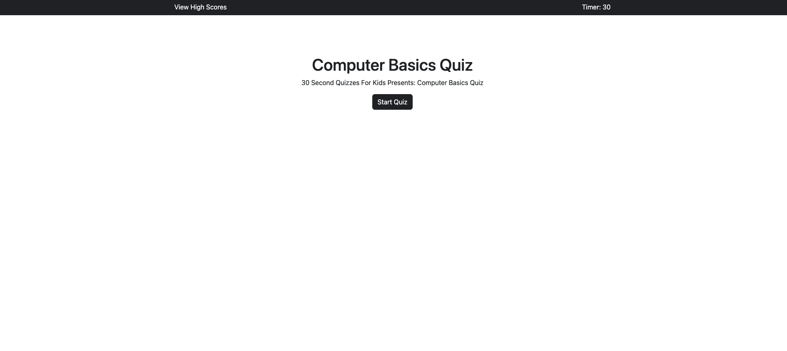
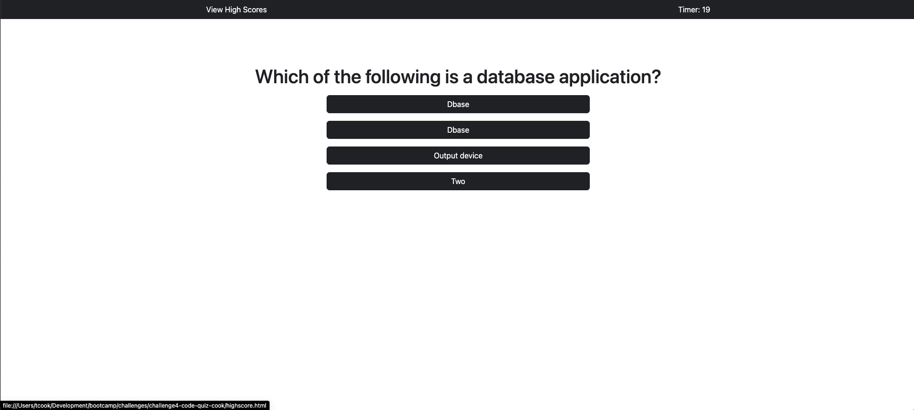
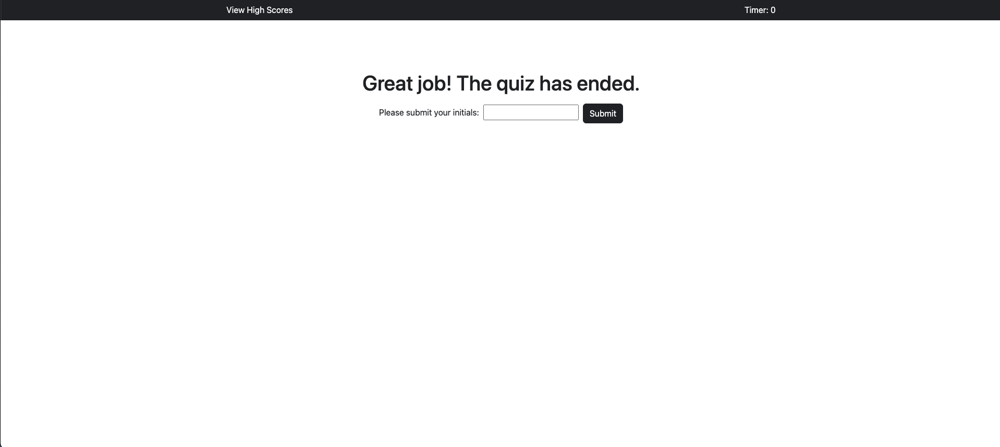
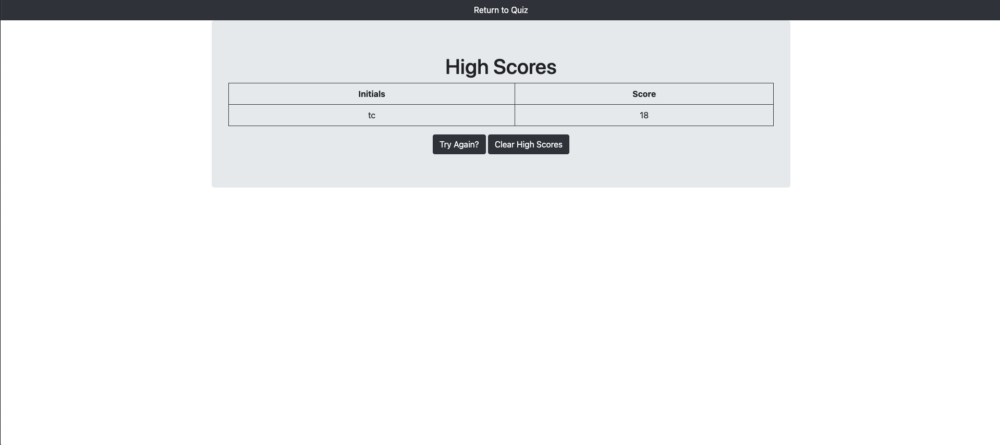

# Challenge4 Code Quiz Cook

Project Page: [Project Page](https://timothymichaelcook.github.io/challenge4-code-quiz-cook/)

Project Repo: [Github-pages](https://github.com/timothymichaelcook/challenge4-code-quiz-cook)

## Description

The focus of this project was to create an application that displayed a timed quiz, with multiple choice questions are displayed as either correct or incorrect as soon as the click event occurred on the button. The quiz will generate as many questions as possible within the timeframe as repetition is important when learning. Users can save their information in a highscores table that will populate every time a score is saved. This table also has the ability to be cleared or reset back to it's default setting.

## User Story

```
- AS AN elementary school teacher
- I WANT to have curriculum on computer fundementals
- SO THAT my students are computer literate
```

## Installation

N/A

## Usage

Users click the "Start Quiz" button which will redirect to a new page with a running timer and a container for displayed questions. Users click their answer or best guess which is then returned with a result. Users finally have the ability to save their scores at the end of every quiz as well as clearing all results as well.


## Credits

N/A

## License

MIT License

## Screenshots







## Contact
Timothy Cook - timothy.michael.cook@gmail.com
